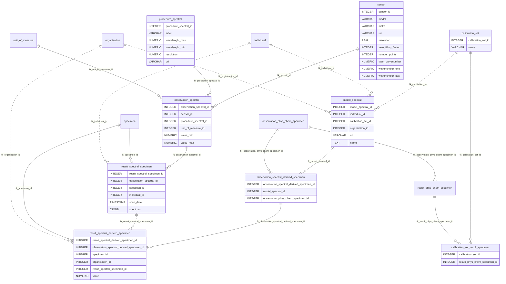
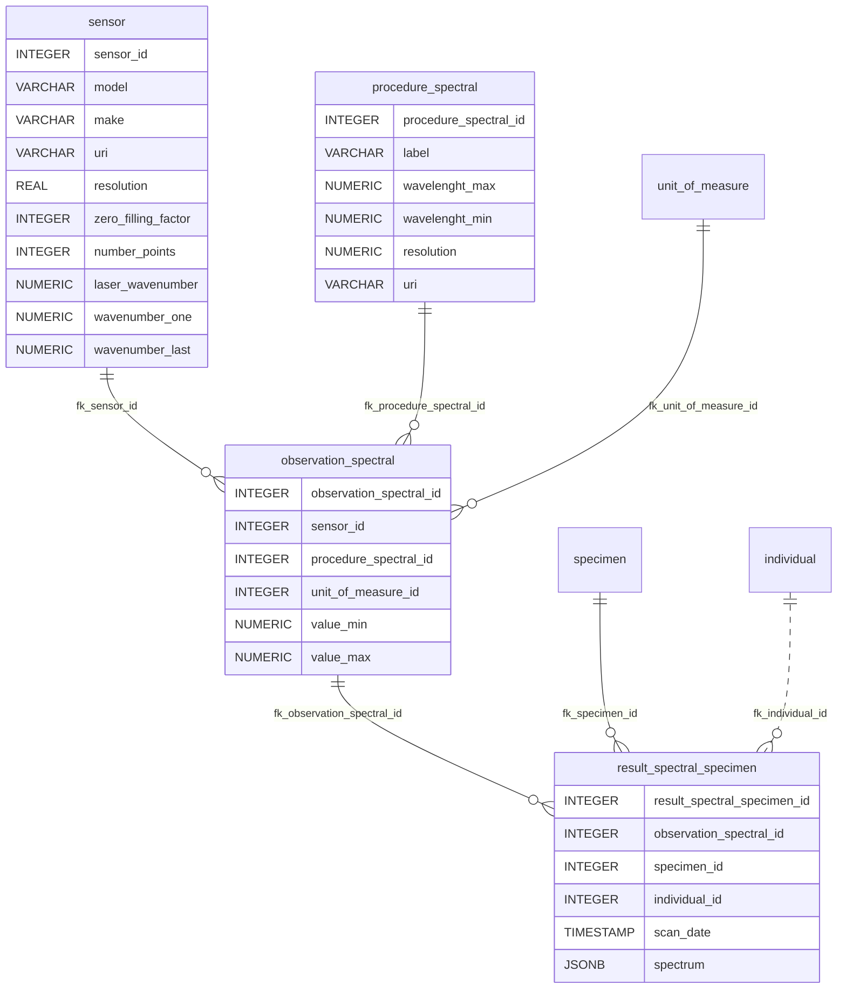
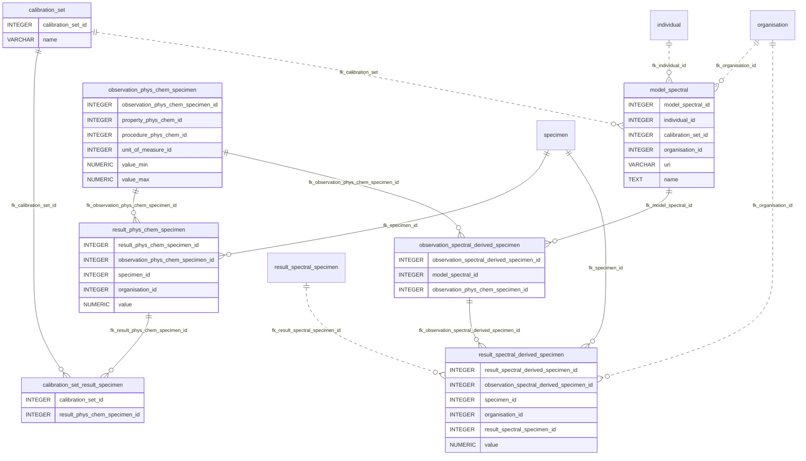

## Spectral Extension for ISO 28258 data model

This extension adds spectral data and spectral-derived physico-chemical results to the [ISO 28258 data model](https://github.com/ISRICWorldSoil/iso-28258) for the Specimen feature of interest.

> **Status:** Work in progress. This is a working version of the spectral extension and still needs to be validated by domain experts before production use.

### Compatibility

- **ISO 28258 v1.5**, **v1.8** and **v1.9** schemas
- Idempotent - safe to run multiple times
- Project-agnostic - no hardcoded role names

### Installation

1. Run the spectral extension SQL script against your database, either with `psql`:

```bash
psql -d <database_name> -f migrations/manual/spectral_extension/spectral_extension.sql
```

   or via graphile-migrate's `run` command (executes against `DATABASE_URL`; add `--shadow` or
   `--root` to target the shadow or root connection):

```bash
yarn gm run migrations/manual/spectral_extension/spectral_extension.sql
```

   The script is idempotent, so either method is safe to repeat.

2. (Optional) Add project-specific GRANT statements by uncommenting and customizing the template grants in the SQL file, replacing `<role_r>` and `<role_w>` with your project roles.

### Features

- **ON DELETE CASCADE**: When a specimen is deleted, related spectral data is automatically cleaned up
- **ETL Functions**: Includes `core.etl_insert_result_spectral_specimen()` and `core.etl_insert_result_spectral_derived_specimen()` for bulk data loading
- **Value validation trigger**: Ensures spectral-derived values are within admissible bounds

### Data Model Overview



### Spectral data



Spectral data (spectrum) is represented following the Observations and Measurements (O&M) approach used by ISO 28258 data model. It includes a `sensor` element to identify the device that measures the spectrum.

Elements:
- **sensor**: An instrument used to perform spectral observations on soil specimens or directly in a soil pit.
- **procedure_spectral**: Identifies bands of the electro-magnetic spectrum in which a spectral sensor operates. E.g. near infra-red, ultra-violet, X-ray. The term procedure is retained for alignment with O&M and SOSA/SSN.
- **observation_spectral**: spectral observation referred to the sensor, procedure and unit of measure.
- **unit_of_measure**
- **result_spectral_specimen**: The discrete spectrum (stored as JSON).

### Spectral derived data




Spectral derived data is the physico-chemical results predicted from the spectral data. The concept of `model` is involved, which predicts the spectral derived data by an algorithm using the `calibration_set`.

Elements:
- **calibration_set**: A collection of physio-chemical results used to calibrate a spectral model.
- **model_spectral**: A computer programme able to estimate physio-chemical observation result(s) from a spectral observation result (spectrum).
- **observation_spectral_derived_specimen**: Spectral derived physio-chemical observation for the specimen feature of interest. Matches a particular spectral derivation model to a target physio-chemical observation.
- **result_spectral_derived_specimen**: Spectral derived physio-chemical result

### ETL Functions

The extension includes two ETL helper functions:

#### `core.etl_insert_result_spectral_specimen`

Inserts a new spectral result (spectrum) for a specimen.

```sql
SELECT core.etl_insert_result_spectral_specimen(
    observation_spectral_id := 1,
    specimen_id := 42,
    scan_date := '25/12/2024',
    individual_id := 5,
    spectrum := '[0.1, 0.2, 0.3, ...]'  -- JSON array
);
```

#### `core.etl_insert_result_spectral_derived_specimen`

Inserts a spectral-derived physico-chemical result.

```sql
SELECT core.etl_insert_result_spectral_derived_specimen(
    observation_spectral_derived_specimen_id := 1,
    specimen_id := 42,
    organisation_id := 3,
    result_spectral_specimen_id := 100,
    value := 6.5
);
```
